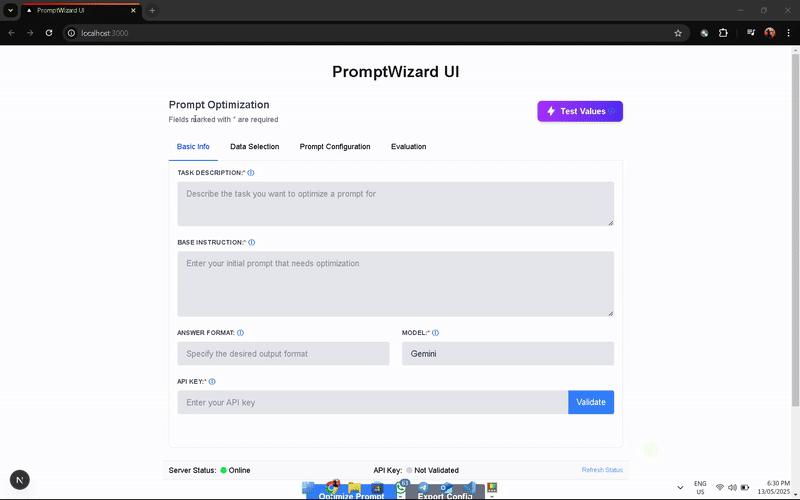
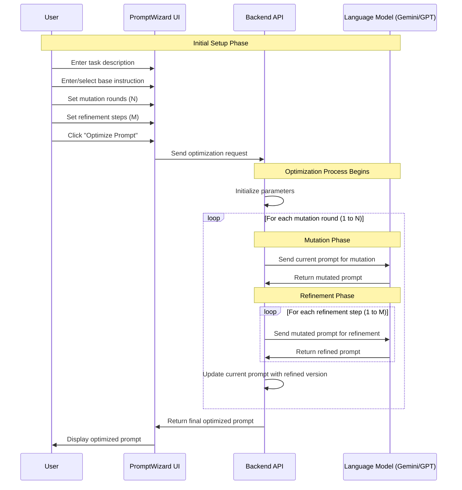
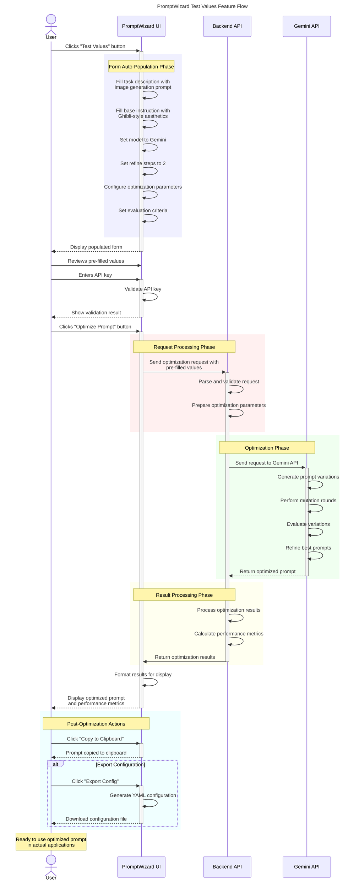

# ✨ PromptWizard UI ✨

<div align="center">
  <a href="https://github.com/microsoft/PromptWizard">
    
  </a>
</div>

<br>

> ### 🚀 **Welcome to PromptWizard UI!**
>
> This project is a modern web interface built on top of Microsoft's PromptWizard framework. Created in a single coding session, it provides an intuitive way to optimize prompts for various LLM tasks.
>
> ⚠️ **Note:** As this was developed rapidly, some features may not be fully implemented. Currently, the Gemini model integration has been tested and works reliably. Other models have code written but haven't been thoroughly tested.
>
> 🧪 **Quick Testing:** Use the "Test Values" button to auto-fill the form with sample data for image generation prompts and quickly test the functionality.
>
> 🤝 **Contributions Welcome:** Whether it's bug fixes, feature enhancements, or documentation improvements, all contributions are appreciated! This is an open project that welcomes community involvement.

## Overview

PromptWizard UI provides a sleek web interface for optimizing prompts using the PromptWizard framework. It allows users to:

- Enter task descriptions and base instructions
- Configure optimization parameters through an intuitive tabbed interface
- Select models and datasets with visual feedback
- Optimize prompts with a single click
- Export optimized prompts and configurations

## Quick Demo Video

<p align="center">
  <a href="https://youtu.be/your_video_id_here" target="_blank">
    
  </a>
  <br>
  <em>Click to watch a quick demo of PromptWizard UI in action</em>
</p>

## Test Values Feature

The "Test Values" button allows you to quickly populate the form with pre-configured values for image generation prompts with Ghibli-style aesthetics.

<details>
  <summary>Test Values Sequence Diagram</summary>


</details>

## Application Flow

<details>
  <summary>Application Flow</summary>


</details>

The optimization process follows these steps:

1. **User Input**: The user provides task description, base instruction, and configuration
2. **API Processing**: The backend processes the request and prepares for optimization
3. **LLM Interaction**: The system interacts with the selected LLM (Gemini/GPT-4)
4. **Optimization Loop**: Multiple rounds of mutation and refinement occur
5. **Result Generation**: The optimized prompt is generated and returned
6. **UI Display**: Results are displayed to the user with evaluation metrics

## Project Structure

- `ui/` - Frontend Next.js application
- `api/` - Backend Flask API

## Getting Started 🚀

### Prerequisites

- Node.js (v18+)
- Python (v3.8+)
- API keys for LLMs (Gemini API key required for testing)

### Installation

1. Install frontend dependencies:
   ```bash
   cd ui
   npm install
   ```

2. Install backend dependencies:
   ```bash
   cd api
   pip install -r requirements.txt
   ```

3. Set up environment variables:
   - Create a `.env` file in the `api/` directory
   - Add your API keys:
     ```
     GOOGLE_API_KEY=your_gemini_api_key
     OPENAI_API_KEY=your_openai_api_key
     ```

### Running the Application

1. Start the backend API:
   ```bash
   cd api
   python app.py
   ```

2. Start the frontend development server:
   ```bash
   cd ui
   npm run dev
   ```

3. Open your browser and navigate to `http://localhost:3000`

### Quick Testing with Test Values

1. Open the application in your browser
2. Click the "Test Values" button in the top-right corner
3. Review the pre-filled form with sample values for image generation
4. Enter your Gemini API key
5. Click "Optimize Prompt" to test the functionality

> **Note:** The Test Values feature is designed to work with the Gemini model, which has been thoroughly tested. Other models may require additional configuration.

## Features

### Prompt Input
Enter task descriptions and base instructions for optimization.

### Dataset Selection
Choose from predefined datasets (GSM8k, SVAMP, AQUARAT, BBII) or use custom data.

### Configuration Options
- **Mutation Rounds**: Number of iterations for prompt mutation
- **Refine Steps**: Number of refinement steps
- **In-context Examples**: Option to use examples during optimization

### Model Selection
Choose between Gemini, GPT-4, or custom models.

### Evaluation Metrics
Select criteria for evaluating prompts:
- Accuracy
- Clarity
- Completeness
- Relevance
- Conciseness

### Export Options
- Download optimized prompts as text files
- Export configurations as YAML files

## Deployment 🌐

### One-Click Vercel Deployment (Recommended)

The application is pre-configured for seamless deployment on Vercel:

1. Push your code to a GitHub repository
2. Connect the repository to Vercel
3. Set up environment variables in the Vercel dashboard:
    (refer to .env.example for all env key names)
   - `GOOGLE_API_KEY`: Your Gemini API key (required for testing)
   - `OPENAI_API_KEY`: Your OpenAI API key (optional)
4. Click "Deploy"

> **Note:** For detailed Vercel deployment instructions, see our [Vercel Deployment Guide](VERCEL_DEPLOYMENT.md).

### Other Deployment Options

- **Docker**: Use our Docker configuration for containerized deployment
- **Cloud Platforms**: Deploy to AWS, Azure, or Google Cloud
- **Traditional Hosting**: Deploy to any platform that supports Node.js and Python

For more deployment options, see our [Deployment Guide](DEPLOYMENT.md).

## System Architecture 🏗️

The PromptWizard UI system consists of three main components:

1. **Frontend (Next.js)**: Provides the user interface for configuring and running prompt optimizations
2. **Backend API (Flask)**: Handles requests from the frontend and communicates with the PromptWizard core
3. **PromptWizard Core**: Microsoft's optimization engine that performs the actual prompt optimization

### Data Flow Diagram

## Integration with Microsoft PromptWizard 🔄

This UI is built on top of Microsoft's PromptWizard framework, providing a user-friendly interface for prompt optimization. It leverages the powerful core functionality of PromptWizard while making it accessible to users without coding experience.

### What Microsoft PromptWizard Provides:
- Core prompt optimization algorithms
- Training and evaluation logic
- Dataset handling capabilities

### What Our UI Adds:
- Intuitive tabbed interface
- Visual configuration of parameters
- One-click optimization
- Export and sharing capabilities
- Quick testing with pre-configured values
- Simplified deployment options

## How PromptWizard Works 🔍
- Using the problem description and initial prompt instruction, PW generates variations of the instruction by prompting LLMs to mutate it. Based on performance, the best prompt is selected. PW incorporates a critique component that provides feedback, thus guiding and refining the prompt over multiple iterations.
- PW also optimizes in-context examples. PW selects a diverse set of examples
from the training data, identifying positive and negative examples based on their performance with
the modified prompt. Negative examples help inform further prompt refinements.
- Examples and instructions are sequentially optimized, using the critique to generate synthetic examples that address the current prompt’s weaknesses. These examples are integrated to further refine the prompt.
- PW generates detailed reasoning chains via Chain-of-Thought (CoT), enriching the prompt’s capacity for problem-solving.
- PW aligns prompts with human reasoning by integrating task intent and expert
personas, enhancing both model performance and interpretability.

## Configurations ⚙️

Here we define the various hyperparameters used in prompt optimization process found in [promptopt_config.yaml](demos/gsm8k/configs/promptopt_config.yaml)

- ```mutate_refine_iterations```: Number of iterations for conducting mutation of task description
 followed by refinement of instructions
- ```mutation_rounds```: Number of rounds of mutation to be performed when generating different styles
- ```refine_task_eg_iterations```: Number of iterations for refining task description and in context examples
- ```style_variation```: Number of thinking style variations to be used in prompt mutation
- ```questions_batch_size```: Number of questions to be asked to LLM in a single batch, during training step
- ```min_correct_count```: Minimum number of batches of questions to correctly answered, for a prompt to be considered as performing good
- ```max_eval_batches```: Maximum number of mini-batches on which we should evaluate the prompt
- ```top_n```: Number of top best prompts to be considered from scoring stage for the next stage
- ```seen_set_size```: Number of samples from trainset to be used for training
- ```few_shot_count```: Number of in-context examples required in final prompt

## Web UI Features 🖥️

The PromptWizard Web UI provides a user-friendly interface for prompt optimization with the following features:

### Tabbed Interface
- **Basic Info**: Configure task description, base instruction, answer format, model, and API key
- **Data Selection**: Choose datasets, configure in-context examples, and preview data
- **Prompt Configuration**: Select optimization scenarios and configure advanced parameters
- **Evaluation**: Set evaluation criteria and manage optimization sessions

#### Basic Info Tab

#### Data Selection Tab

#### Prompt Configuration Tab

#### Evaluation Tab

### Advanced Features
- **Advanced Optimization Parameters**: Fine-tune the optimization process with parameters like mutate refine iterations, refine task examples iterations, and more
- **Advanced Evaluation Metrics**: Use metrics like Faithfulness, Semantic Similarity, Context Relevancy, and more
- **Dataset Preview**: Visualize and inspect your dataset before optimization
- **Multimodal Support**: Optimize prompts for image-based tasks with image uploads
- **Session Management**: Save and load optimization sessions for later use
- **Test Values Button**: ✨ Quickly populate the form with pre-configured values for image generation prompts to test functionality

### Results Page

The results page displays:
- The optimized prompt
- Performance metrics and evaluation scores
- Comparison with the original prompt
- Export options (copy to clipboard, download as text, export configuration)

### Deployment Options
- **Local Development**: Run the UI and API locally for development
- **Docker Deployment**: Use Docker for containerized deployment ([see Docker instructions](DEPLOYMENT.md#docker-deployment))
- **Vercel Deployment**: One-click deployment to Vercel ([see Vercel guide](VERCEL_DEPLOYMENT.md))
- **Cloud Deployment**: Deploy to platforms like Azure, AWS, or GCP ([see Cloud instructions](DEPLOYMENT.md#cloud-deployment))

## Best Practices 💡

Following are some of best pracitices we followed during are experiments
- Regarding the parameters in [promptopt_config.yaml](demos/gsm8k/configs/promptopt_config.yaml)
    - We found the best performing values for ```mutate_refine_iterations```,```mutation_rounds```,```refine_task_eg_iterations``` to be 3 or 5
    - Other parameters have been set to their ideal values. ```seen_set_size``` can be increased to 50 and ```few_shot_count``` can be set based on the use case
- The prompts generated at the end of the training process are usually very detailed, however user supervision can help tune it further for the task at hand
- Trying both configurations of having synthetic in-context examples or in-context examples from the train set can be tried to find the best prompt based on use case.
- When using the Web UI, the "Test Values" button provides a good starting point with pre-configured values for image generation prompts

## Results 📈

<p align="center">
  
  <p align="center">PromptWizard consistently outperforms other methods across various
thresholds, maintaining the highest p(τ) values, indicating that it consistently performs near the best
possible accuracy across all tasks</p>
</p>

- The fiqure shows the performance profile curve for the instruction induction
tasks. The performance profile curve visualizes how frequently
different approaches’ performance is within a given distance of the best performance. In this curve,
the x-axis (τ) represents the performance ratio relative to the best-performing method, and the y-axis
(p(τ )) reflects the fraction of tasks where a method’s performance is within this ratio. So for a given
method, the curve tells what percentage of the tasks are within τ distance to the best performance.

## Contributing 🤝

### We'd Love Your Help!

This project was built in a single coding session, so there's plenty of room for improvement and expansion. Your contributions are not just welcome—they're essential to making this tool better for everyone!

### Areas Where You Can Help:

- **Feature Implementation**: Help complete and test features for different LLM models
- **UI Enhancements**: Improve the user interface and experience
- **Documentation**: Enhance the documentation with examples and tutorials
- **Bug Fixes**: Help identify and fix bugs in the codebase
- **Testing**: Contribute to testing different features and models

### How to Contribute:

1. **Fork the repository**
2. **Create a feature branch**: `git checkout -b feature/amazing-feature`
3. **Commit your changes**: `git commit -m 'Add some amazing feature'`
4. **Push to the branch**: `git push origin feature/amazing-feature`
5. **Open a Pull Request**

### Original PromptWizard Contribution Guidelines:

This project builds on Microsoft's PromptWizard. For contributions to the core framework, please note that most contributions require you to agree to a Contributor License Agreement (CLA) declaring that you have the right to, and actually do, grant us the rights to use your contribution. For details, visit https://cla.microsoft.com.

This project has adopted the [Microsoft Open Source Code of Conduct](https://opensource.microsoft.com/codeofconduct/). For more information see the [Code of Conduct FAQ](https://opensource.microsoft.com/codeofconduct/faq/).

## Citation 📝

```
@misc{agarwal2024promptwizardtaskawarepromptoptimization,
      title={PromptWizard: Task-Aware Prompt Optimization Framework},
      author={Eshaan Agarwal and Joykirat Singh and Vivek Dani and Raghav Magazine and Tanuja Ganu and Akshay Nambi},
      year={2024},
      eprint={2405.18369},
      archivePrefix={arXiv},
      primaryClass={cs.CL},
      url={https://arxiv.org/abs/2405.18369},
}
```
## Responsible AI Considerations
For guidelines and best practices related to Responsible AI, please refer to our [Responsible AI Guidelines](RESPONSIBLE_AI.md).

## Contributing

Contributions are welcome! Please feel free to submit a Pull Request.
